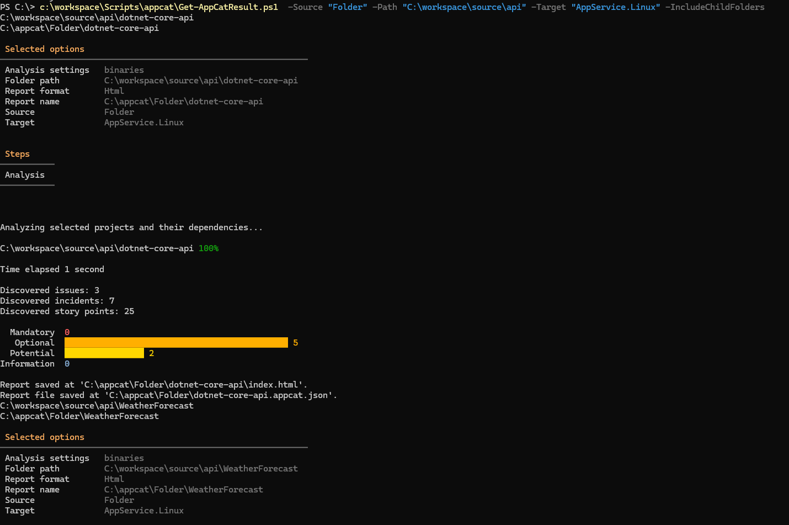

# Get-AppCatResult PowerShell Script

## Overview

The Get-AppCatResult PowerShell script (`Get-AppCatResult.ps1`) is a tool for analyzing .NET applications and assessing their readiness for deployment to various target environments. It leverages the `appcat` command-line tool to perform the analysis.

## Script Details

### Parameters

The script accepts the following named parameters:

- **Path**: The path to the .NET application to be analyzed. Default value: `C:\path\to\your\project.sln`.
- **Target**: The target environment for deployment. Possible values include `Any`, `AppService.Linux`, `AppService.Windows`, `AppServiceContainer.Linux`, `AppServiceContainer.Windows`, `ACA`, `AKS.Linux`, `AKS.Windows`. Default value: `Any`.
- **ReportPath**: The path to store the assessment results. Default value: `C:\appcat`.
- **Serializer**: The format for the assessment report. Possible values include `json`, `csv`, `html`. Default value: `html`.
- **Source**: The source of the application to be analyzed. Possible values include `Solution`, `Folder`, `IISServer`. Default value: `IISServer`.
- **IISSiteName**: (Optional) The name of the IIS site(s) to analyze. This parameter accepts multiple site names separated by commas.
- **IncludeChildFolders**: Switch parameter to specify whether to include analysis of child folders when the Source is a folder.

### Dependencies

Ensure the following dependencies are installed and configured:

1. **PowerShell**: Version 5.1 or later.
2. **.NET Framework or .NET Core SDK**: Required for analyzing .NET applications.
3. **appcat**: Ensure the `appcat` command-line tool is available in the system's PATH or provide the full path to the executable in the script.
4. **Optional Dependencies**: Any additional dependencies required by the script or the `appcat` tool.
## Install the .NET global tool
Azure Migrate application and code assessment for .NET is also available as a .NET global tool. You can install the tool with the following command.
```powershell   
    dotnet tool install -g dotnet-appcat
```
Similarly, to update the tool, use the following command:
```powershell  
    dotnet tool update -g dotnet-appcat
```
## Usage Examples

1. For Source as Solution:
 ```powershell
.\Get-AppCatResult.ps1 -Source "Solution" -Path "C:\path\to\your\project.sln" -Target "AppService.Linux"
.\Get-AppCatResult.ps1 -Source "Solution" -Path "C:\path\to\your\project.sln" -Target "AppService.Windows"
.\Get-AppCatResult.ps1 -Source "Solution" -Path "C:\path\to\your\project.sln" -Target "AppServiceContainer.Linux"
.\Get-AppCatResult.ps1 -Source "Solution" -Path "C:\path\to\your\project.sln" -Target "AppServiceContainer.Windows"
.\Get-AppCatResult.ps1 -Source "Solution" -Path "C:\path\to\your\project.sln" -Target "ACA"
.\Get-AppCatResult.ps1 -Source "Solution" -Path "C:\path\to\your\project.sln" -Target "AKS.Linux"
.\Get-AppCatResult.ps1 -Source "Solution" -Path "C:\path\to\your\project.sln" -Target "AKS.Windows"
.\Get-AppCatResult.ps1 -Source "Solution" -Path "C:\path\to\your\project.sln" -Target "Any"
 ```

2. For Source as Folder:
 - #### Root folder only
```powershell
.\Get-AppCatResult.ps1 -Source "Folder" -Path "C:\path\to\your\folder" -Target "AppService.Linux" 
.\Get-AppCatResult.ps1 -Source "Folder" -Path "C:\path\to\your\folder" -Target "AppService.Windows" 
.\Get-AppCatResult.ps1 -Source "Folder" -Path "C:\path\to\your\folder" -Target "AppServiceContainer.Linux" 
.\Get-AppCatResult.ps1 -Source "Folder" -Path "C:\path\to\your\folder" -Target "AppServiceContainer.Windows" 
.\Get-AppCatResult.ps1 -Source "Folder" -Path "C:\path\to\your\folder" -Target "ACA" 
.\Get-AppCatResult.ps1 -Source "Folder" -Path "C:\path\to\your\folder" -Target "AKS.Linux" 
.\Get-AppCatResult.ps1 -Source "Folder" -Path "C:\path\to\your\folder" -Target "AKS.Windows" 
.\Get-AppCatResult.ps1 -Source "Folder" -Path "C:\path\to\your\folder" -Target "Any" 
```
- #### Root folder and sub folder 
```powershell
.\Get-AppCatResult.ps1 -Source "Folder" -Path "C:\path\to\your\folder" -Target "AppService.Linux" -IncludeChildFolders
.\Get-AppCatResult.ps1 -Source "Folder" -Path "C:\path\to\your\folder" -Target "AppService.Windows" -IncludeChildFolders
.\Get-AppCatResult.ps1 -Source "Folder" -Path "C:\path\to\your\folder" -Target "AppServiceContainer.Linux" -IncludeChildFolders
.\Get-AppCatResult.ps1 -Source "Folder" -Path "C:\path\to\your\folder" -Target "AppServiceContainer.Windows" -IncludeChildFolders
.\Get-AppCatResult.ps1 -Source "Folder" -Path "C:\path\to\your\folder" -Target "ACA" -IncludeChildFolders
.\Get-AppCatResult.ps1 -Source "Folder" -Path "C:\path\to\your\folder" -Target "AKS.Linux" -IncludeChildFolders
.\Get-AppCatResult.ps1 -Source "Folder" -Path "C:\path\to\your\folder" -Target "AKS.Windows" -IncludeChildFolders
.\Get-AppCatResult.ps1 -Source "Folder" -Path "C:\path\to\your\folder" -Target "Any" -IncludeChildFolders
```

3. For Source as IISServer:
```powershell
.\Get-AppCatResult.ps1
.\Get-AppCatResult.ps1 -Source "IISServer"  -Target "AppService.Linux"
.\Get-AppCatResult.ps1 -Source "IISServer"  -Target "AppService.Windows"
.\Get-AppCatResult.ps1 -Source "IISServer"  -Target "AppServiceContainer.Linux"
.\Get-AppCatResult.ps1 -Source "IISServer"  -Target "AppServiceContainer.Windows"
.\Get-AppCatResult.ps1 -Source "IISServer"  -Target "ACA"
.\Get-AppCatResult.ps1 -Source "IISServer"  -Target "AKS.Linux"
.\Get-AppCatResult.ps1 -Source "IISServer"  -Target "AKS.Windows"
.\Get-AppCatResult.ps1 -Source "IISServer"  -Target "Any"
```

4. For Source as IISServer with multiple IISSiteName values:
```powershell
.\Get-AppCatResult.ps1 -Source "IISServer" -IISSiteName "Site1,Site2" -Target "AppService.Linux"
.\Get-AppCatResult.ps1 -Source "IISServer" -IISSiteName "Site1,Site2" -Target "AppService.Windows"
.\Get-AppCatResult.ps1 -Source "IISServer" -IISSiteName "Site1,Site2" -Target "AppServiceContainer.Linux"
.\Get-AppCatResult.ps1 -Source "IISServer" -IISSiteName "Site1,Site2" -Target "AppServiceContainer.Windows"
.\Get-AppCatResult.ps1 -Source "IISServer" -IISSiteName "Site1,Site2" -Target "ACA"
.\Get-AppCatResult.ps1 -Source "IISServer" -IISSiteName "Site1,Site2" -Target "AKS.Linux"
.\Get-AppCatResult.ps1 -Source "IISServer" -IISSiteName "Site1,Site2" -Target "AKS.Windows"
.\Get-AppCatResult.ps1 -Source "IISServer" -IISSiteName "Site1,Site2" -Target "Any"
```




## Author

- **Author:** Ravinder Singh Rana
- **Email:** talk2rana@gmail.com

If you have any questions or suggestions, feel free to contact me at [talk2rana@gmail.com](mailto:talk2rana@gmail.com).


